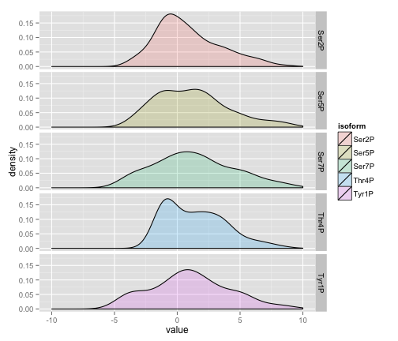
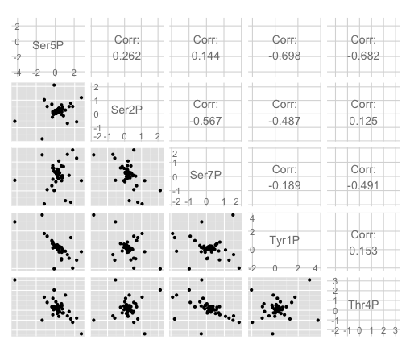
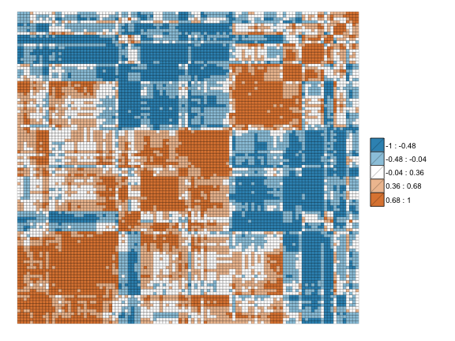

Network analysis on PolII CTD isoform interactors
========================================================


### Data preparation
First load the data and assign the row names 


### Quick look into the data
Let's first check the distributions of each CTD phospho isoform masspec reads. 


```r
require(ggplot2)
require(GGally)

gnames<-rownames(prots)

# data frame for ggplot
tmp<-data.frame(value=matrix(data=t(prots),nrow=nrow(prots)*ncol(prots),ncol=1))
tmp[,'isoform']<-rep(colnames(prots),by=nrow(prots))
tmp[,'gene']<-rep(rownames(prots),each=ncol(prots))


p<-ggplot(tmp,aes(value, fill=isoform))+geom_density(alpha=.2)+facet_grid(isoform~.,) + scale_x_continuous(limit=c(-10,10))

print(p)
```

 

### Phosphoisophorm correlation analysis
Let's see how the different isoforms are interrelated. 

```r
ggpairs(prots)
```

 

This is actually what we don't want. This plot tells us that all these events share a common determinant, i.e. the polymerase itself, which we already know.If we were to compare these isoform interactors with the rest of the whole cell, then the data with its current form would be sufficient and informative. However, we would like to compare across the isoform interactors and try to resolve the differences. Hence, we should rescale the data so that each row will represent a specific protein's interaction weights with the phospho isoforms. For example, protein X can have high reads in each isoform just because of its abundance in the nucleus. Once we calculate the weights by dividing the total reads, we will find out the interaction strength with phosphoisoforms relative to each other.  

Let's see what happens if we normalize the data:


```r
prots<-prots[-which(is.na(rowSums(prots))),]
protN<-prots/rowSums(prots) #Normalize the prots by their row sum
ggpairs(protN)
```

 

That emphasizes the differences more than the similarities. Basically, by renormalizing the data, we abondon the common determinants and focused on the dissimilarities. 

### Protein correlation analysis
Now we can analyze which proteins are interacting similarly to the same CTD phosphoisoforms. Each protein has a vector of size 5 and we can use Pearson correlation moments since the data are continues and well-distributed around zero (sort of) -That's why we should check the distributions in the first hand-.


```r
library(reshape2)
library(zoo)

corPr<-cor(t(protN),method='pearson')
rownames(corPr)<-colnames(corPr)<-rownames(prots)


h<-hclust(d=as.dist(1-corPr),method='average')
cR<-corPr[h$order,h$order]

quantile_range <- quantile(corPr, probs = seq(0, 1, 0.2))
color_palette <- colorRampPalette(c("#3794bf", "#FFFFFF", "#df8640"))(length(quantile_range) - 1)
 
## discretize matrix; this is the most important step, where for each value we find category of predefined ranges (modify probs argument of quantile to detail the colors)
mod_mat <- matrix(findInterval(cR, quantile_range, all.inside = TRUE), nrow = nrow(cR))
rownames(mod_mat)<-colnames(mod_mat)<-rownames(cR)
label_text <- rollapply(round(quantile_range, 2), width = 2, by = 1, FUN = function(i) paste(i, collapse = " : "))

## remove background and axis from plot
theme_change <- theme(
 plot.background = element_blank(),
 panel.grid.minor = element_blank(),
 panel.grid.major = element_blank(),
 panel.background = element_blank(),
 panel.border = element_blank(),
 axis.line = element_blank(),
 axis.ticks = element_blank(),
 axis.text.x = element_blank(),
 axis.text.y = element_blank(),
 axis.title.x = element_blank(),
 axis.title.y = element_blank()
)
p <- ggplot(data=melt(mod_mat), aes(x=Var1, y=Var2, fill=factor(value))) + geom_tile() + geom_tile(color = "black") + scale_fill_manual(values = color_palette,name = "", labels = label_text) + theme_change
print(p)
```

 

The heatmap shows multiple clusters which tells that there are combinatorial interactions rather than two patterns, e.g. 5' and 3' interactors.

### Network view
Now, lets check how it looks like as a network.
For this, we cut the cluster into 4 groups and color these groups. Here we show the interactions only if the correlation is larger than 0.9. 


```r
require(network)
source('~/Documents/Codes/plotg.R') # change this for your local settings, i.e. whereever you put plotg.R in

ct<-cutree(h,k=cls)

netMat<-matrix(0,ncol=ncol(cR),nrow=nrow(cR))
netMat[cR>th]<-1
colnames(netMat)<-rownames(netMat)<-rownames(mod_mat)

net<-as.network(netMat)
set.vertex.attribute(net,'elements',rownames(cR))
set.vertex.attribute(net,'groups',ct[h$order]) # change the groups attribute for whatever you want. 
plotg(net)
```

 

Ok. That's quite interesting. First of all, we capture the polymerase complex itself in the same group. 
